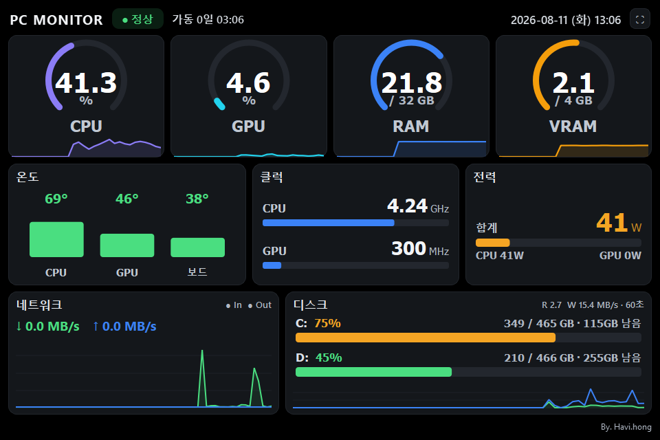

# PC Monitor Dashboard

960x640 미니모니터용 하드웨어 모니터링 대시보드 (Windows)


## 기능

- **CPU/GPU 사용률** — 원형 게이지 + 스파크라인
- **메모리/VRAM** — 사용량/전체 용량 게이지
- **온도** — CPU, GPU, 메인보드 (수평 바 차트)
- **클럭** — CPU(GHz), GPU(MHz) 프로그레스 바
- **소비 전력** — CPU/GPU 와트 표시
- **네트워크** — 다운/업 속도 + 실시간 그래프
- **디스크** — Read/Write 속도 + 드라이브별 사용량

## 다운로드 및 실행

### 다운로드

[Releases 페이지](https://github.com/hong-havi/pc-monitor/releases)에서 최신 버전의 `PCMonitor.exe`를 다운로드합니다.

### 실행 방법

온도, 클럭, 전력 등 하드웨어 센서 데이터를 읽으려면 **관리자 권한**이 필요합니다.

1. 다운로드한 `PCMonitor.exe`를 원하는 폴더에 저장
2. `PCMonitor.exe`를 **우클릭** → **관리자 권한으로 실행**
3. Windows SmartScreen 경고가 뜨면 **추가 정보** → **실행** 클릭

> **팁:** 매번 관리자 권한으로 실행하려면:
> 1. `PCMonitor.exe` 우클릭 → **속성**
> 2. **호환성** 탭 → **관리자 권한으로 이 프로그램 실행** 체크 → 확인

### 요구 환경

- Windows 10/11
- 별도 설치 필요 없음 (단일 exe 실행 파일)

---

## 요구사항 (개발용)

- Windows 10/11
- Python 3.13+ (MS Store 또는 공식 배포판)
- 아래 Python 패키지 (시스템에 설치):
  - PyQt6, psutil, pywin32, wmi, pythonnet, pyinstaller
- [LibreHardwareMonitor](https://github.com/LibreHardwareMonitor/LibreHardwareMonitor) (온도/클럭/전력 데이터)

## 빠른 시작 (새 환경)

```bash
# 1. 저장소 클론
git clone <repo-url>
cd pc-monitor

# 2. Python 의존성 설치
pip install PyQt6 psutil pywin32 wmi pythonnet pyinstaller

# 3. 라이브러리 다운로드 (LHM DLL/exe)
scripts\setup_libs.bat

# 4. EXE 빌드
scripts\build.bat
```

빌드 결과: `dist\PCMonitor.exe`

## 개발 모드 실행

```bash
python src/main.py
```

> 온도/클럭/전력을 읽으려면 LibreHardwareMonitor가 관리자 권한으로 실행 중이어야 합니다.

## 스크립트

| 스크립트 | 설명 |
|---------|------|
| `scripts/setup_libs.bat` | NuGet/GitHub에서 LHM 라이브러리 자동 다운로드 |
| `scripts/build.bat` | PyInstaller로 단일 exe 빌드 |

## LibreHardwareMonitor 연동

센서 데이터(온도, 클럭, 전력)를 읽는 우선순위:

1. **HTTP 웹서버** (`http://localhost:8085/data.json`) — LHM GUI에서 Options → Remote Web Server 활성화 시
2. **WMI** (`root\LibreHardwareMonitor`) — LHM GUI 실행 시 자동 노출
3. **DLL 직접 로드** (`LibreHardwareMonitorLib.dll`) — 번들된 DLL로 직접 읽기

> LHM 없이도 CPU 사용률, 메모리, GPU 사용률(D3DKMT), 네트워크, 디스크는 정상 동작합니다.

### LHM 설정 방법

1. [LibreHardwareMonitor 0.9.6+](https://github.com/LibreHardwareMonitor/LibreHardwareMonitor/releases) 다운로드
2. **관리자 권한**으로 실행
3. Options → Remote Web Server → Run 체크 (HTTP 서버 활성화)

PCMonitor.exe는 LHM을 자동으로 백그라운드 실행합니다 (`lib/lhm-096` 번들).

## 릴리스 배포

태그를 push하면 GitHub Actions가 자동으로 빌드하여 Release에 exe를 첨부합니다.

```bash
# 새 버전 릴리스
git tag v1.1.0
git push origin v1.1.0
```

워크플로우: `.github/workflows/release.yml`

---

## 프로젝트 구조

```
pc-monitor/
├── src/
│   ├── main.py                  # 진입점
│   ├── core/
│   │   ├── hardware_monitor.py  # 하드웨어 데이터 수집 통합
│   │   ├── lhm_launcher.py     # LHM 자동 실행/종료 관리
│   │   ├── lhm_reader.py       # 센서 읽기 (HTTP > WMI > DLL)
│   │   └── gpu_d3dkmt.py       # GPU 사용률 (D3DKMT API)
│   └── ui/
│       ├── main_window.py       # 메인 윈도우 레이아웃
│       ├── styles.py            # 색상/스타일 정의
│       └── widgets/
│           ├── gauge_widget.py  # 원형 게이지 + 스파크라인
│           ├── temp_widget.py   # 온도 바
│           ├── bar_widget.py    # 클럭/전력 위젯
│           ├── network_widget.py # 네트워크 그래프
│           └── disk_widget.py   # 디스크 사용량
├── scripts/
│   ├── setup_libs.bat           # 라이브러리 다운로드
│   └── build.bat                # EXE 빌드
├── lib/                         # (gitignore) setup_libs.bat으로 생성
│   ├── lhm/                     # LibreHardwareMonitorLib NuGet
│   ├── lhm-096/                 # LHM 0.9.6 실행파일
│   └── hidsharp/                # HidSharp NuGet
├── dist/                        # (gitignore) 빌드 결과
├── .gitignore
└── README.md
```
